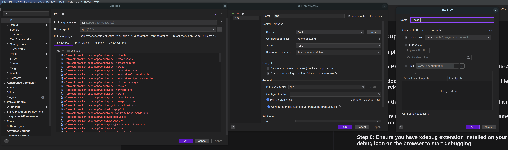
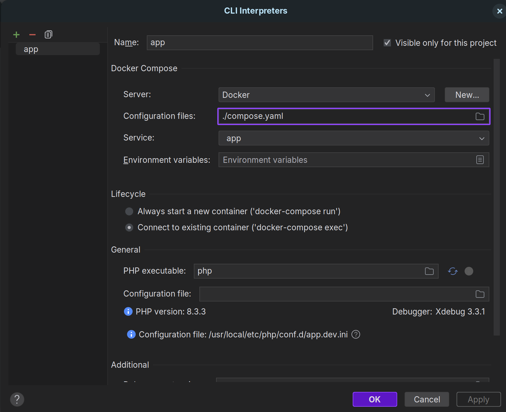
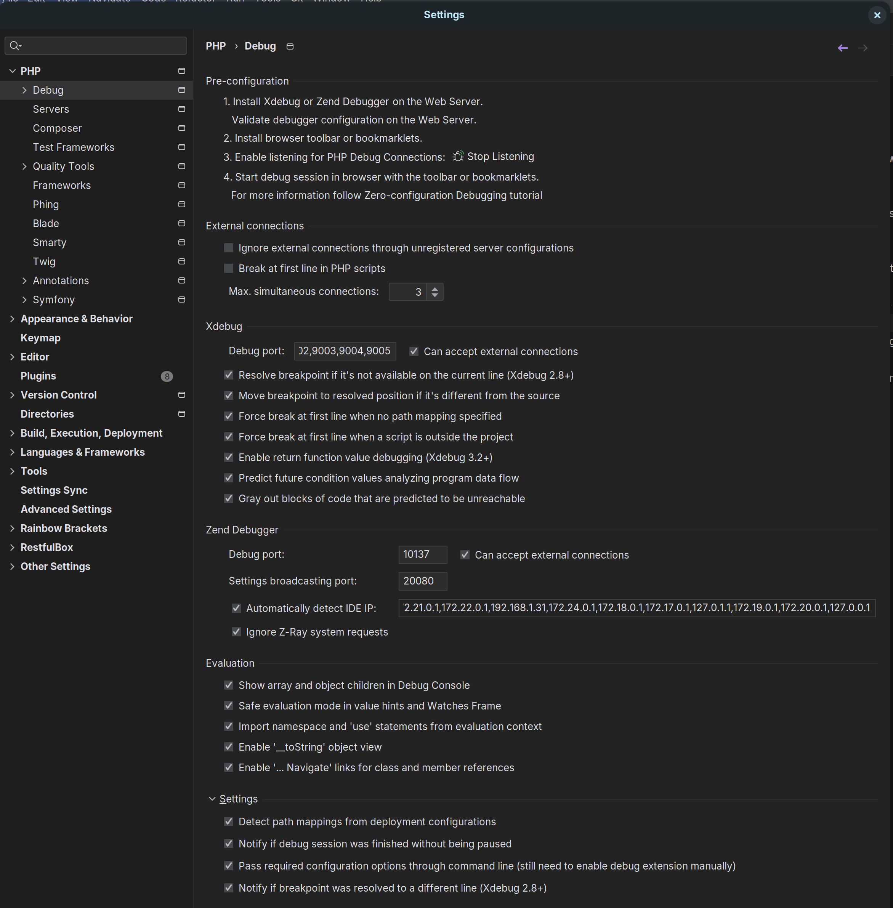
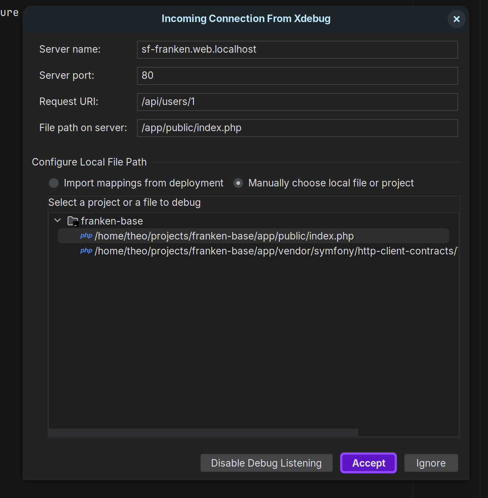
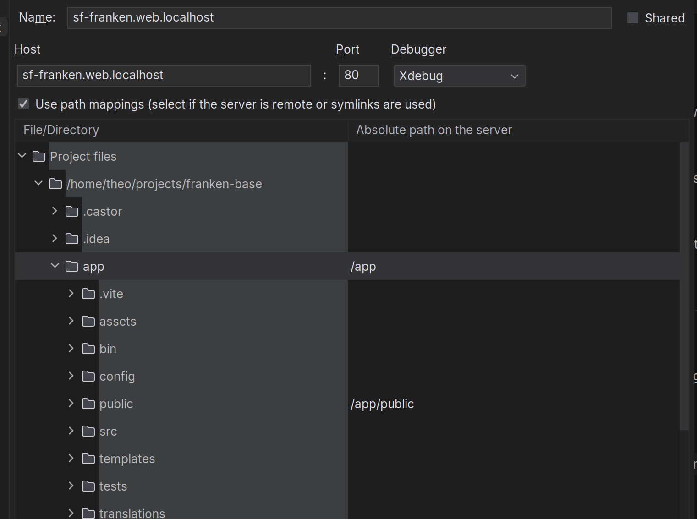
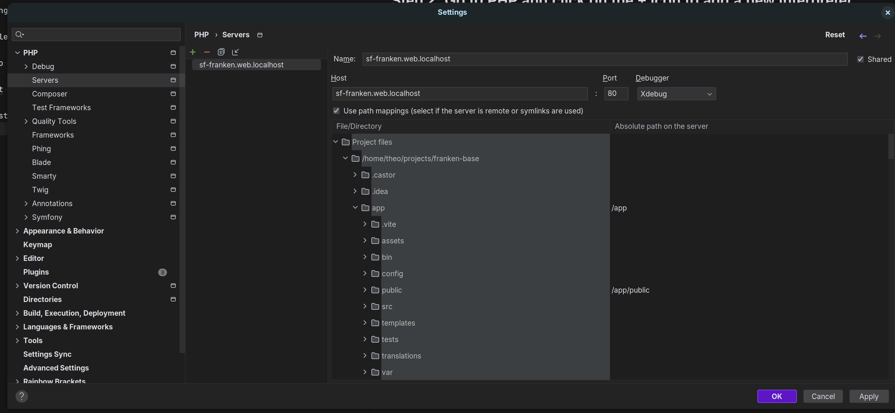

# How to setup xdebug on phpstorm

## Step 1: Open phpstorm and go to settings

## Step 2: Go to PHP and click on the + icon to add a new interpreter

## Step 3: Add docker as the server and select the compose file of the project (select the container service named "app")

## Step 4: Ensure that port on phpstorm is listening to the same port as the xdebug port on the container generally in the range of 9000-9005

## Step 5: Ensure you have xdebug extension installed on your browser, and click on the debug icon on the browser to start debugging

## Step 6: Set a breakpoint on the code you want to debug and refresh the page on the browser, it show you a popup to select the server you want to debug on, just click on accept

** By default the server add mapping for public folder, you should add the mapping like this on app folder or root depending on your project structure

!!!note
    
Some time the server mapping is not correct ensure that the server mapping is correct

